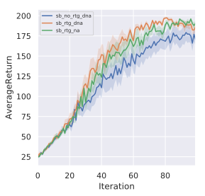
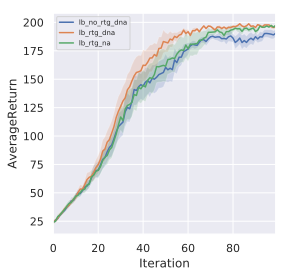
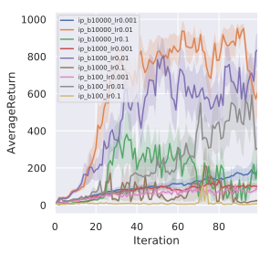
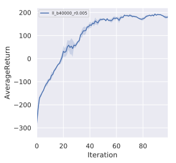
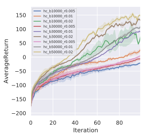
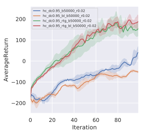

## HW2: Policy Gradients

### Problem 1: State-dependent baseline

Solution can be found [here](prob1/prob1.pdf).

  
### Problem 4: CartPole

| **Key** | **Meaning**                  |
| ------- | ---------------------------- |
| sb/lb   | small/large batch size       |
| (d)na   | (don't) normalize advantages |
| rtg     | reward to go                 |




*Results:*
* `rtg_dna` is the winner.  
* A larger batch-size causes more stable and robust learning (smoother learning curves).  
* There's no clear theoretical justification for advantage centering (at least, not for the way it's been implemented in this assignment), and empirically, it doesn't seem to be useful either.

  
### Problem 5: InvertedPendulum

Hyperparameter search over *batch-size* and *learning-rate*:



  
### Problem 7: LunarLander

``` bash
python3 train_pg_f18.py LunarLanderContinuous-v2 -ep 1000 --discount 0.99 -n 100 -e 3 -l 2 -s 64 -b 40000 -lr 0.005 -rtg --nn_baseline --exp_name ll_b40000_r0.005
```



  
### Problem 8: HalfCheetah

**Left:** Hyperparameter search over *batch-size* and *learning-rate*. Discount is set to `0.9`.  
**Right:** Comparison of different implementations of Policy Gradients on best hyperparameters obtained from hyperparameter search. Discount is set to `0.95`.




*Results:*

* `b50000_r0.02` wins the hyperparameter search. A larger batch-size can support a larger learning-rate and offer better learning performance (at the cost of more computation!).
* Using *reward-to-go* instead of *total reward* improves performance significantly.
* Using a state-dependent baseline doesn't make much of a difference on average but it's variance is smaller.
