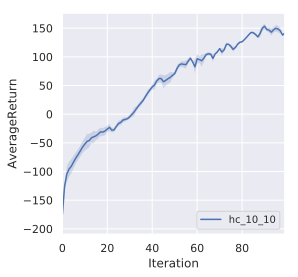

## HW3: Q-Learning and Actor-Critic

### Q-Learning

**Sanity check with Lunar Lander**

**Question 1: Basic Q-Learning performance**  
**Question 2: Double Q-Learning**

**Question 3: Experimenting with hyperparameters**

I chose to experiment with the target network update frequency. `--target-update-freq` defines how many main network updates are performed between successive target network updates. Main network updates start after the replay memory has filled up and occur every 4 timesteps.

### Actor-Critic

**Question 1: Sanity check with CartPole**

**Question 2: Run Actor-Critic with more difficult tasks**

HalfCheetah (hc) and InvertedPendulum (ip).

