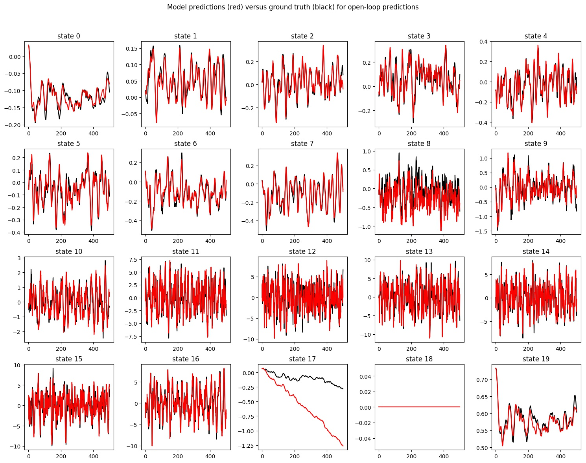
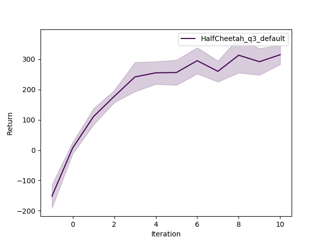
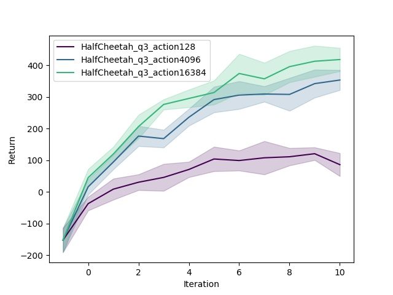
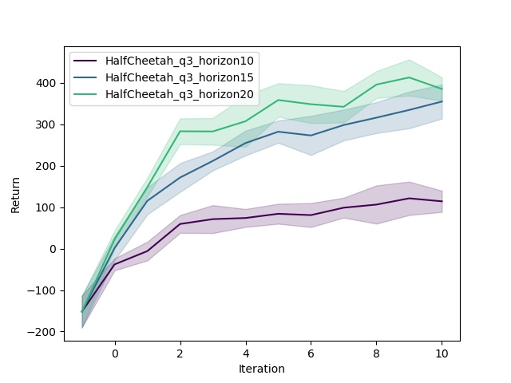
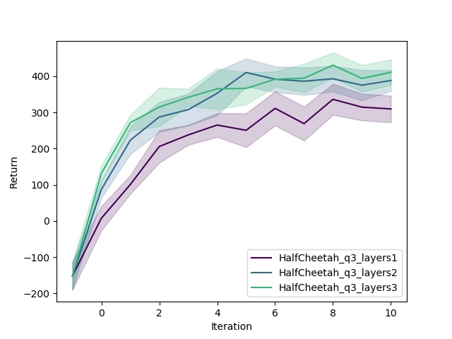

## HW4: Model-Based RL

### Problem 1

**Dynamics Model**

Sometimes the learned dynamics model goes to infinity after 500 timesteps (see for example [this plot](plots/q1/prediction_001.jpg).)  
Predicting `state 17` seems to be hard.

### Problem 2

| Policy      | Total Return       |
| ----------- | ------------------ |
| Random      | -151.877 ± 38.3052 |
| Model-Based | 38.8864 ± 20.3343  |

### Problem 3a

**MBRL with on-policy data collection on HalfCheetah"

### Problem 3b

**Hyperparameter sensitivity plots**

