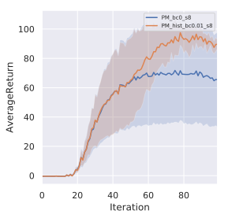
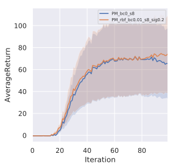
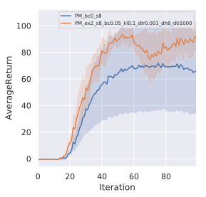
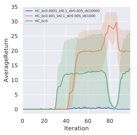

## HW5a: Exploration

### Problem 1

Reward bonus with a histogram density model in the PointMass environment:

### Problem 2

Reward bonus with a RBF kernel density estimator in the PointMass environment:

### Problem 3

[EX2](https://arxiv.org/abs/1703.01260) exploration in the PointMass environment:

### Problem 4

EX2 exploration in the *sparse HalfCheetah* environment:

